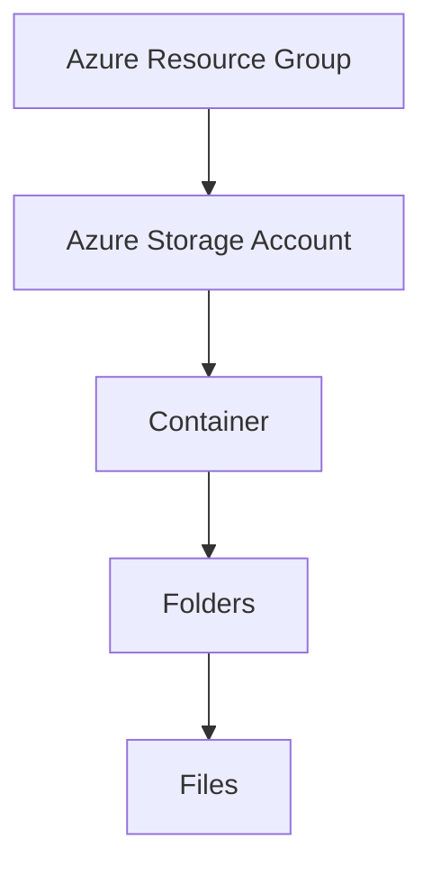

Azure Storage is one of the core services in Microsoft Azure, and is used to support applications that require `non-relational` data stores.

## CLI
You can create a new Azure Storage account by using the Azure CLI with the following command:

```powershell
az storage account create
```

[[Azure Blob Storage]]

---
## Azure Data Lake Storage Gen 2
`Azure DataLake Storage Gen2` offers a hierarchical namespace for your Azure Storage account. In order to use this feature, you need to enable the "`Hiearchical Namespace`" option when creating a new Storage Account or updating an existing one. But, keep in mind that this is a one-way process, you can't revert back to `Gen1` (flat namespaces.)

The following is the hierarchy behind the service:


The Azure Data Lake Storage solution also provides native support for POSIX-compliant access control lists (ACLs). Besides this, Data Lake Storage also supports RBAC at the file and folder level.

`POSIX ACLs` are more fine-grained access rights for files and directories. 

---

`Azure Files` is a way to create cloud-based network shares, to make documents and other files available to multiple users, with a limit to up 100 TB of data in a single storage account. The maximum size of a single file is 1 TB. Also, Azure File Storage supports up to 2000 concurrent connections per shared file.

Azure File Storage offers two performance tiers:
- Standard - Uses HDDs
- Premium - Uses SSDs => higher cost

It supports two common network file sharing protocols:
- `Server Message Block` (SMB) - Commonly used on Windows, Linux and macOS
- `Network File System` (NFS) - Used by some versions of Linux and macOS.

---

`Azure Table Storage` is a `NoSQL` storage solution that makes use of tables containing `key/value` data items.

However, this is not a relational database, as the data stored in Azure Table Storage is `semi-structured`. Each row has a unique key, composed by a partition key and a row key.

There is no concept of foreign key, and the data is denormalized.

Also, the data is split into `partitions` using the partition-key of each row.

---

If you want the data in the account to be replicated outside the Azure region automatically, you need two types of replication turned on:
- Read-Access Geo-Redundant Storage (RA-GRS)
- Geo-Redundant Storage (GRS)